# WireGuard AWS Showcase Project 🚀


**A portfolio project demonstrating modern DevOps automation.** This repository automates the deployment of a split-tunnel VPN mesh between a local workstation and a segmented AWS VPC.

> ⚠️ **Note:** This is a **showcase project** designed to demonstrate Infrastructure as Code and Network Engineering skills. While functional, it trades certain production hardening measures for architectural clarity and ease of demonstration.

---

## 🏗️ Architecture

This project implements a **Hub-and-Spoke** topology using a Bastion Host as the WireGuard gateway.

```mermaid
graph TB
    subgraph Local["💻 Local Environment"]
        Laptop["Your Laptop<br/>(WG Client: 10.0.3.3)"]
    end

    subgraph AWS["☁️ AWS VPC (10.0.0.0/16)"]
        direction TB
        subgraph Public["🔓 Public Subnet (10.0.1.0/24)"]
            Bastion["🏢 Bastion Host<br/>(WG Hub: 10.0.3.1)<br/>Public IP + EIP"]
            IGW["🌐 Internet Gateway"]
        end

        subgraph Private["🔒 Private Subnet (10.0.2.0/24)"]
            PrivateHost["📦 Private Instance<br/>(WG Client: 10.0.3.2)<br/>No Public IP"]
            NAT["🔄 NAT Gateway"]
        end
    end

    Laptop <==>|"WireGuard UDP:51820"| Bastion
    Bastion <==>|"SSH Tunnel / Internal Traffic"| PrivateHost
    PrivateHost -.->|"Outbound Internet"| NAT
    NAT -.-> IGW
```



---

## 📊 Project Stats

| Metric | Value | Context |
|--------|-------|---------|
| Infrastructure | ~21 Resources | VPC, Subnets, EC2, SGs, NAT Gateway |
| Automation | ~1,500 Lines | Bash glue scripts for Setup, Cleanup & Diagnostics |
| Config Mgmt | ~25 Tasks | Ansible Playbooks for OS & VPN config |
| Deploy Time | < 3 Minutes | Full cold-start to active VPN connection |

---

## 🚀 Quick Start

### 1. Complete Setup

Deploys AWS infra, configures WireGuard on servers, and generates local client config.

```bash
./scripts/setup.sh
```

### 2. Connect Client

Configures your local network interface.

```bash
# Quick mode (Interactive)
./scripts/wireguard_client.sh

# Auto mode (CI/CD friendly)
./scripts/wireguard_client.sh --auto

# If wg0 is already in use
WG_INTERFACE=wg1 ./scripts/wireguard_client.sh
```

### 3. Start VPN & Test

```bash
# Copy config and start VPN (default interface: wg0)
sudo cp local_wg0.conf /etc/wireguard/wg0.conf
sudo wg-quick up wg0

# If you used WG_INTERFACE=wg1 in step 2, adjust accordingly:
# sudo cp local_wg1.conf /etc/wireguard/wg1.conf
# sudo wg-quick up wg1

# Test connectivity
ping -c 3 10.0.3.1  # Bastion via VPN
ping -c 3 10.0.3.2  # Private instance via VPN

# SSH to private instance via VPN
ssh -i ~/.ssh/wireguard-wireguard-setup ubuntu@10.0.3.2
```

### 4. Diagnostics

Runs a suite of connectivity tests (SSH handshakes, internal pings) to verify the mesh.

```bash
./scripts/diagnostics.sh
```

### 5. Cleanup

**Crucial:** Destroys all AWS resources and removes local network interfaces.

```bash
./scripts/cleanup.sh

# Verbose mode (see terraform output)
./scripts/cleanup.sh -v

# Check for orphaned resources
./scripts/cleanup.sh --check-orphans
```

---

## 🔧 Engineering Decisions & Trade-offs

### Architecture

- **NAT Gateway:** Included to properly isolate the Private Subnet while allowing outbound updates.
  - *Cost Note:* NAT Gateways incur hourly AWS costs (~$0.045/hr). Remember to run cleanup when done.

- **Bastion as VPN Hub:** The Bastion acts as the entry point. Traffic to the private instance (10.0.3.2) is routed securely through the tunnel, meaning the private instance requires zero public ingress rules.

### Security

- **Ed25519 SSH Keys:** Modern elliptic-curve cryptography for faster, more secure authentication.

- **Dynamic IP Whitelisting:** The `setup.sh` script queries an external API to find your current public IP and injects it into Terraform variables. Security Groups are locked down to only your current location, not `0.0.0.0/0`.

### Automation

- **State Tracking:** Scripts maintain local state files to track created interface names and resource IDs, ensuring `cleanup.sh` is robust and leaves no "orphan" resources.

- **Retry Logic:** Cleanup includes retry logic (3 attempts) to handle transient AWS failures.

- **Interface Conflict Detection:** The client script detects existing WireGuard interfaces and suggests alternatives.

### Known Limitations (Non-Production)

| Area | Current | Production Would Use |
|------|---------|---------------------|
| Secrets | Local `~/.ssh/` | AWS Secrets Manager / Vault |
| Key Rotation | Manual | Automated rotation policy |
| Monitoring | None | CloudWatch, VPC Flow Logs |
| Persistence | Runtime config | systemd / cloud-init |

---

## 📚 Documentation

| File | Description |
|------|-------------|
| [DETAILED_GUIDE.md](DETAILED_GUIDE.md) | Step-by-step walkthrough of the code logic |
| [terraform/](terraform/) | HCL modules for VPC and EC2 |
| [ansible/](ansible/) | Playbooks for package management and WireGuard |
| [scripts/](scripts/) | Bash automation connecting Terraform and Ansible |

---

## 📋 Prerequisites

| Tool | Purpose | Install |
|------|---------|---------|
| AWS CLI | Cloud access | `aws configure` (Admin permissions) |
| Terraform | Infrastructure | [terraform.io/downloads](https://terraform.io/downloads) |
| Ansible | Configuration | `pip install ansible` |
| WireGuard | VPN client | `sudo apt install wireguard` |

---

## 🎓 Skills Demonstrated

- **Cloud Architecture:** VPC design with public/private subnet separation
- **Network Security:** Security groups, bastion pattern, VPN tunneling
- **Automation:** End-to-end scripted deployment with error handling
- **Configuration Management:** Ansible playbooks for consistent configuration
- **Infrastructure as Code:** Terraform modules and state management
- **Troubleshooting:** Diagnostic tooling for debugging connectivity issues
